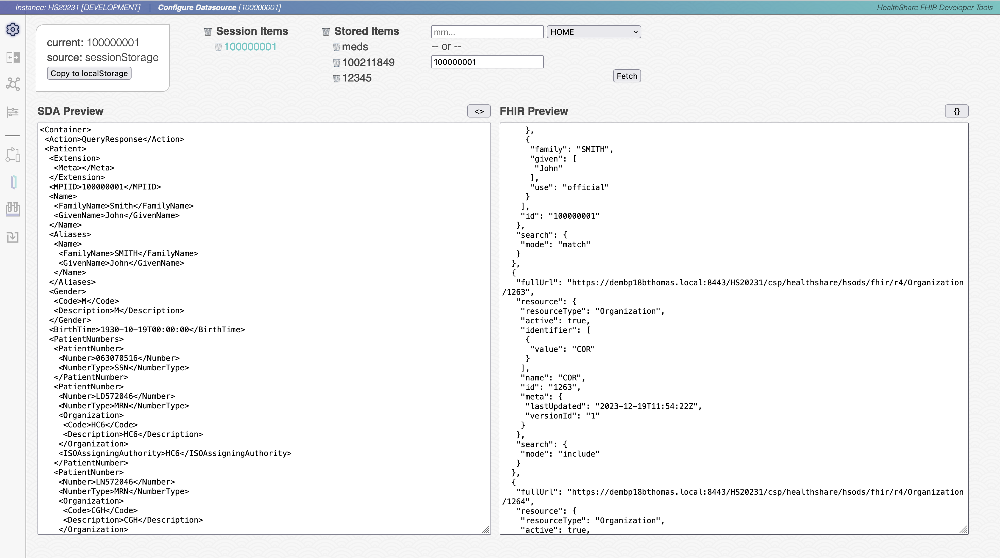
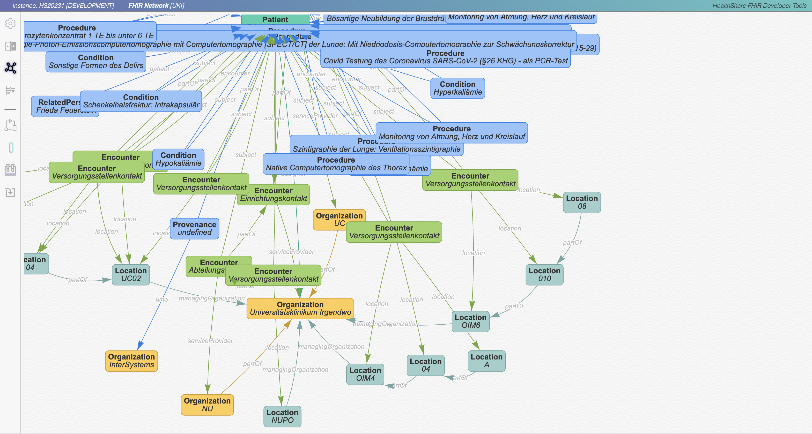
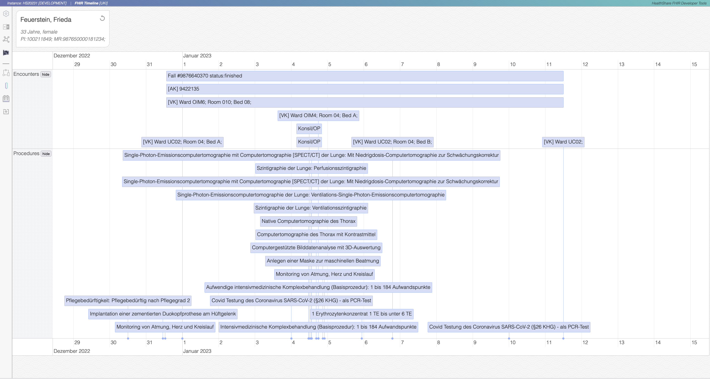
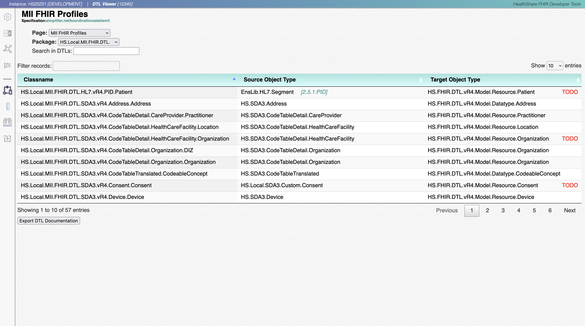
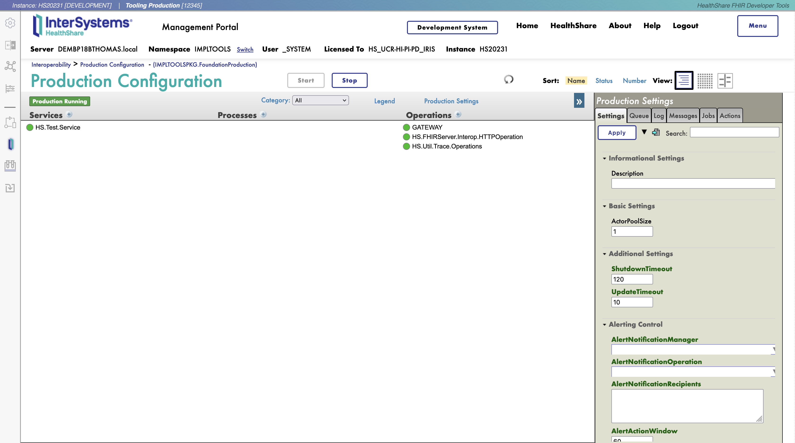

# zimpl:FHIR Profiling Toolkit for HealthShare
*2024-03-13 • Brandon Thomas*

## Contents
- [Scope](#scope)
- [Installation](#installation)
    - [Classes and Dependencies](#classes-and-dependencies)
    - [Configure Production](#configure-production)
    - [Navigate to the Startpage](#navigate-to-the-startpage)
    - [Disclaimer](#disclaimer)
- [Known Issues](#known-issues)
- [Roadmap](#roadmap)

## Scope
This package provides a number of tools which were developed to aid in the implementation of the [German MII FHIR profiles](https://simplifier.net/organization/koordinationsstellemii) in [InterSystems HealthShare](https://www.intersystems.com/interoperability-platform/).  These tools are not intended for production use.

Many thanks to our sponsor for this project, the University Hospital of Hamburg-Eppendorf, Germany :tada:

[](https://www.uke.de)

Here are some screenshots with descriptions of the tool in action...

---

*Retrieve and compare SDA Containers with FHIR Bundles by MRN/AA or MPIID*

---

*Network diagram which displays the hierarchy of all resources within a FHIR bundle*

---

*Timeline diagram of specific FHIR resources within a bundle*

---

*Extensible DTL Viewer with search, filter and export capabilities*

---

*Integrated Management Portal*


## Installation
### Import Classes
- [ ] Import and compile the classes from GitHub in the *HSCUSTOM* namespace.

### Configure Production
A foundation-type production is required in HealthShare for retrieving SDA and FHIR. An installer method will configure this for you.

- [ ] From the terminal, use the installer script to setup the new namespace `ZIMPLFHIRPRO` and configure the production:
``` objectscript
HSCUSTOM> do ##class(HS.Local.zimpl.fhirpro.API.Installer).Install()
```
#### Now in the Management Portal:

- [ ] Configure the *Business Operation* **GATEWAY**
    - The **ServiceName** setting needs to use an AccessGateway known in the Service Registry, for example: `dembp18bthomas.local:HSACCESS`
- [ ] Configure the *Business Operation* **HS.FHIRServer.Interop.HTTPOperation**
    - The **ServiceName** setting needs an HTTP Endpoint for FHIR (ODS), for example: `FHIR.Service.R4`  
    If you use this standard service, you may need to configure the `HTTPCredentialsConfig` setting on the *Service Registry* entry.
- [ ] :bulb: Optionally add the *Business Operation* **HS.Util.Trace.Operations** 

- [ ] Start the production

### Web Dependencies
- [ ] Unzip and save the contents of 

`zimplfhirpro_Dependencies-*.zip` 

to the following directory:

`{HealthShare Installation}/csp/healthshare/zimplfhirpro/` 

### Navigate to the Startpage
<http://localhost:52774/csp/healthshare/zimplfhirpro/HS.Local.zimpl.fhirpro.UI.Index.cls>

## Disclaimer
:warning: This application is not supported by InterSystems Corporation. Please be notified that you use it at your own risk.

## Known Issues & Caveats
### 2024-01-12
- custom DTLViewer classes should now extend 
`HS.Local.zimpl.fhirpro.UI.DTLViewer`

## Roadmap
- Add REST API in ODS to handle ReloadPatient(), etc from this tool