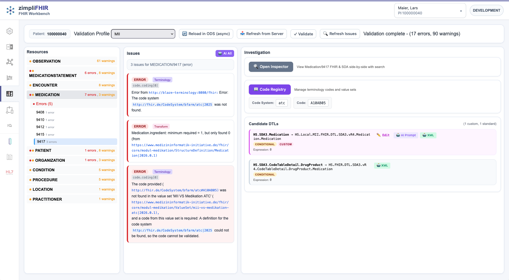

# zimpliFHIR Profiling Toolkit for HealthShare
*2026-04-17 • Brandon Thomas*

## Contents
- [Overview](#overview)
- [Installation](#installation)
    - [Classes and Dependencies](#classes-and-dependencies)
    - [FHIR Validators](#fhir-validators)
    - [Configure Production](#configure-production)
    - [Navigate to the Startpage](#navigate-to-the-startpage)
    - [Disclaimer](#disclaimer)
- [Changelog](#changelog)
- [License](#license)

## Overview

zimpliFHIR is a **developer-focused toolkit** for working with FHIR (and SDA3) in InterSystems HealthShare and IRIS. This package provides a number of tools which were developed to aid in the implementation of the [German MII FHIR profiles](https://simplifier.net/organization/koordinationsstellemii) in [InterSystems HealthShare](https://www.intersystems.com/interoperability-platform/). These tools are not intended for production use.

It supports:

* development and debugging of FHIR profiles  
* transformation validation (HL7 --> SDA <--> FHIR)  
* inspection of relationships between FHIR resources  
* temporal visualization for understanding data behavior  

---

## Core Capabilities

### 🔍 Data Exploration
* Inspect FHIR resources in context  
* Navigate references and dependencies  
* Identify missing or inconsistent links  

### 🔄 Transformation Support
* Compare SDA3 and FHIR representations  
* Inspect and debug DTL transformations  

### 🕒 Temporal Visualization
* Timeline view of FHIR data (encounters, observations, medications, procedures, conditions)
* Expects the Encounter hierarchy as defined in MII

### 🧠 Relationship Analysis
* Graph-based visualization of FHIR resources  
* Highlight reference chains and integrity issues  

### ✅ Validation (REST)
* The relationship graph view can call external **FHIR validation services** via HTTP.  
* Validators are configured through the **Service Registry** (see below).

### 🔧 FHIR Validation Workbench
* **Three-pane issue investigation** - resource tree, issue list, and detailed investigation
* **Issue categorization** - grouped by resource type, severity (errors/warnings), and cause bucket
* **Candidate DTL analysis** - automatic identification of relevant transformations with custom/standard indicators
* **Terminology support** - quick access to Code Registry with auto-extracted codes and displays for easy fixes
* **AI-assisted troubleshooting** - generate comprehensive prompts for AI analysis including:
  - All issues for a resource or single-issue focus for DTL investigation
  - Full FHIR resource context and DTL transformation logic
  - Copy-to-clipboard integration for AI tools
* **Data Inspector integration** - side-by-side FHIR/SDA3 view with search and deep-linking
* **Session management** - save/load validation results with automatic MPIID tracking

### Screenshots


*Retrieve and compare SDA Containers with FHIR Bundles by MRN/AA or MPIID*

---

*Network diagram which displays the hierarchy of all resources within a FHIR bundle. Resource Validation, inspection, and filtering available here.*

---

*Timeline diagram of specific FHIR resources within a bundle. Expects MII Encounter hierarchies.*

---

*Extensible DTL Viewer with search, filter and export capabilities*

---

*FHIR Validation Workbench for investigating validation issues with integrated DTL analysis and AI troubleshooting prompts*

---

## Installation

### Classes and Dependencies
- [ ] Import and compile the classes from GitHub in the *HSCUSTOM* namespace.

---

## FHIR Validators

The repository includes a `validators/` directory with a ready-to-run setup and an optional MII validator:

```
validators/
  └── r4core-fhir-validator/
```

The MII validator is **not included by default** and must be cloned manually (see below).

---

### 🔹 R4 Core Validator

Location: `validators/r4core-fhir-validator`

This setup provides a lightweight validation container using Docker Compose.

Start via:

```bash
cd validators/r4core-fhir-validator
docker compose up -d
```

Runs on:
```
http://localhost:4567
```

Typical endpoint:
```
/validate
```

This validator:
- supports FHIR R4 core profiles
- does not include terminology services (SNOMED, etc.)

---

### 🔹 MII Validator (Recommended for German profiles)

This validator is based on the official MII project:

https://github.com/medizininformatik-initiative/mii-fhir-validator

#### Setup

Clone the repository into the `validators/` directory:

```bash
cd validators
git clone https://github.com/medizininformatik-initiative/mii-fhir-validator.git
```

Then follow the instructions in the official README.

⚠️ Notes:
- Setup is **non-trivial** and requires multiple steps
- Requires **SNOMED CT International RF2 release 20250701**
- Terminology files must be properly extracted and configured as described upstream

#### Start validator

Refer to the upstream documentation for the exact startup procedure.

Default endpoint (typically):
```
http://localhost:8080/validateResource
```

---

### 🔹 Service Registry Integration

zimpliFHIR discovers validators dynamically via the **Service Registry**.

Define HTTP entries where Name starts with `zimpliFHIR:validation:`


Example:

| Name                          | Host      | Port | URL             |
|-------------------------------|-----------|------|-----------------|
| zimpliFHIR:validation:r4core  | localhost | 4567 | /validate       |
| zimpliFHIR:validation:mii     | localhost | 8080 | /validateResource |

These entries:

- are used by **HS.Local.zimpli.fhir.Production.HTTPOperation**
- appear automatically in **FHIR Relationship Graph** validation dropdown

---

## Configure Production

A foundation-type production is required in HealthShare for retrieving SDA and FHIR. An installer method will configure this for you.

- [ ] From the terminal, use the installer script to setup the new namespace `ZIMPLIFHIR` and configure the production:

```objectscript
HSCUSTOM> do ##class(HS.Local.zimpli.fhir.API.Installer).Install()
```

#### Now in the Management Portal:

- [ ] Configure the *Business Operation* **GATEWAY** for SDA retrieval:
  - Set the **ServiceName** to an AccessGateway defined in the Service Registry  
    Example: `dembp18bthomas.local:HSACCESS`

- [ ] Configure the *Business Operation* **HS.FHIRServer.Interop.HTTPOperation**:
  - Used for FHIR retrieval **and validation**
  - Set the **ServiceName** to a default FHIR endpoint or validator entry  
    Example: `FHIR.ServiceSecure.R4`
  - The ServiceName can be overridden in the Datasource UI

- [ ] :bulb: Optionally add the *Business Operation* **HS.Util.Trace.Operations**

- [ ] Start the production

---

## Web Dependencies

The following external libraries are contained in the included zip file:

- [jQuery](https://jquery.com/)
- [DataTables css and js](https://datatables.net/)
- [simple tree table](https://github.com/kanety/jquery-simple-tree-table)
- [vis-network](https://visjs.org/)
- [vis-timeline](https://visjs.org/)

---

- [ ] Copy the contents of the csp_assets folder to:

```
{HealthShare Installation}/csp/healthshare/zimplifhir/
```

---

## Navigate to the Startpage

```
http://localhost:52774/csp/healthshare/zimplifhir/HS.Local.zimpli.fhir.UI.Index.cls
```

---

## Disclaimer

:warning: This application is not supported by InterSystems Corporation.  
Use at your own risk.

---

## Changelog

### Current Release
- Renamed Class structure (!)
- UI cleanup and consolidation across all components
- Improved SDA3 and FHIR Inspector
- Improved encounter-centric visualization in **Patient Journey** timeline
- Extended **FHIR Relationship Graph**:
  - resource-type grouping
  - support for external FHIR validation services (REST)
- Various usability and interaction improvements

### Roadmap
- Add REST API in ODS to handle ReloadPatient(), etc from this tool
- Add tools for managing ^ISCSOAP,^FSLOG; verify custom DTL package; Extension Mapping; FHIR validation

---

## License

This and all external libraries included with this package are available as open source under the terms of the [MIT License](https://opensource.org/license/MIT).

---

## Sponsors

Many thanks to our sponsor, the University Hospital of Hamburg-Eppendorf (UKE), Germany, for supporting this project and enabling the development of its first comprehensive user interface :tada:

[](https://www.uke.de)