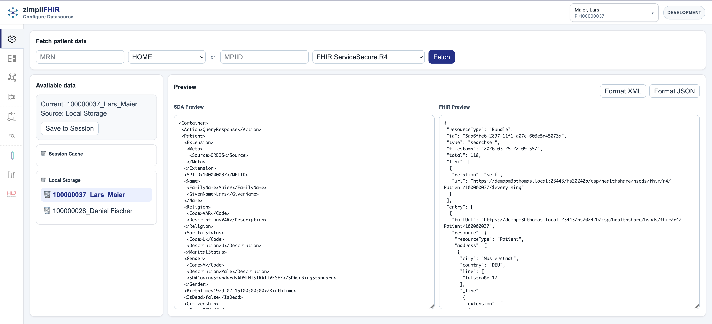
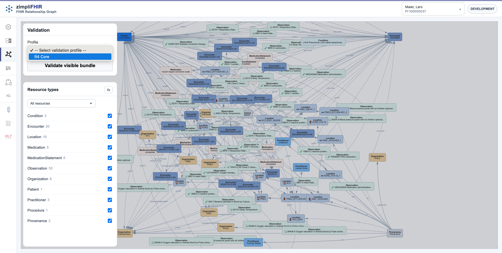
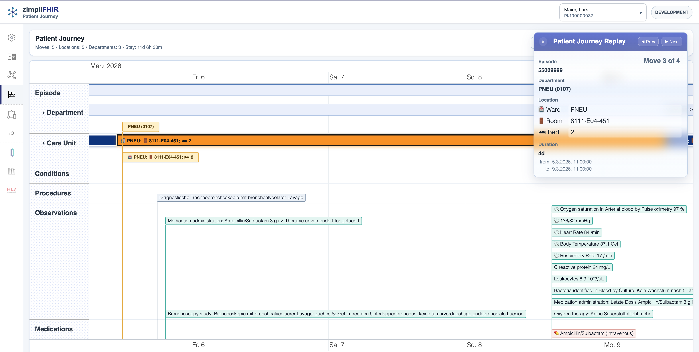
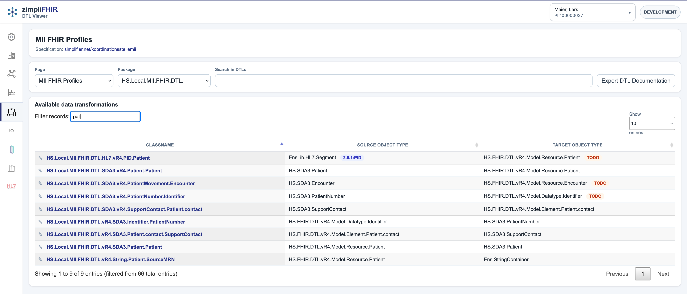

# zimpliFHIR Profiling Toolkit for HealthShare
*2026-03-30 • Brandon Thomas*

## Contents
- [Scope](#scope)
- [Installation](#installation)
    - [Classes and Dependencies](#classes-and-dependencies)
    - [Configure Production](#configure-production)
    - [Navigate to the Startpage](#navigate-to-the-startpage)
    - [Disclaimer](#disclaimer)
- [Known Issues](#known-issues)
- [Roadmap](#roadmap)
- [License](#license)

## Overview

FHIRPro is a **developer-focused toolkit** for working with FHIR in InterSystems HealthShare and IRIS. This package provides a number of tools which were developed to aid in the implementation of the [German MII FHIR profiles](https://simplifier.net/organization/koordinationsstellemii) in [InterSystems HealthShare](https://www.intersystems.com/interoperability-platform/).  These tools are not intended for production use.

It supports:

* development and debugging of FHIR profiles
* transformation validation (HL7 --> SDA <--> FHIR)
* inspection of relationships between FHIR resources
* temporal visualization for understanding data behavior


## Core Capabilities

### 🔍 Data Exploration

* Inspect FHIR resources in context
* Navigate references and dependencies
* Identify missing or inconsistent links

### 🔄 Transformation Support

* Compare SDA3 and FHIR representations
* Inspect and debug DTL transformations

### 🕒 Temporal Visualization

* Timeline view of FHIR data (encounters, observations, medications, procedures, conditions)

### 🧠 Relationship Analysis

* Graph-based visualization of FHIR resources
* Highlight reference chains and integrity issues

### ✅ Validation (REST)

The relationship graph view can call an external **FHIR validation service** via HTTP (configured through the Service Registry).

Example validator (Docker):

```bash
docker run --rm -p 4567:4567 \
  --name fhir-validator-core \
  -e DISABLE_TX=true \
  -e DISPLAY_ISSUES_ARE_WARNINGS=true \
  infernocommunity/fhir-validator-service:latest
```

### Screenshots


*Retrieve and compare SDA Containers with FHIR Bundles by MRN/AA or MPIID*

---

*Network diagram which displays the hierarchy of all resources within a FHIR bundle. Resource Validation, inspection, and filtering available here.*

---

*Timeline diagram of specific FHIR resources within a bundle. Expects MII Encounter hierarchies.*

---

*Extensible DTL Viewer with search, filter and export capabilities*

---


## Installation
### Import Classes
- [ ] Import and compile the classes from GitHub in the *HSCUSTOM* namespace.

### Configure Production
A foundation-type production is required in HealthShare for retrieving SDA and FHIR. An installer method will configure this for you.

- [ ] From the terminal, use the installer script to setup the new namespace `ZIMPLFHIRPRO` and configure the production:
``` objectscript
HSCUSTOM> do ##class(HS.Local.zimpli.fhir.API.Installer).Install()
```
#### Now in the Management Portal:

- [ ] Configure the *Business Operation* **GATEWAY**
    - The **ServiceName** setting needs to use an AccessGateway known in the Service Registry, for example: `dembp18bthomas.local:HSACCESS`
- [ ] Configure the *Business Operation* **HS.FHIRServer.Interop.HTTPOperation**
    - The **ServiceName** setting needs an HTTP Endpoint for FHIR (ODS), for example: `FHIR.Service.R4`  
    Note: you may need to configure the `HTTPCredentialsConfig` and  `SSL Configuration` settings in the *Service Registry* entry.
- [ ] :bulb: Optionally add the *Business Operation* **HS.Util.Trace.Operations** 

- [ ] Start the production

### Web Dependencies
The following external libraries are contained in the included zip file:
- [jQuery](https://jquery.com/)
- [DataTables css and js](https://datatables.net/)
- [simple tree table](https://github.com/kanety/jquery-simple-tree-table)
- [vis-network](https://visjs.org/)
- [vis-timeline](https://visjs.org/)

---
- [ ] Unzip and save the contents of 

`zimplifhir_Dependencies-*.zip` 

to the following directory:

`{HealthShare Installation}/csp/healthshare/zimplifhir/`

### Navigate to the Startpage
<http://localhost:52774/csp/healthshare/zimplifhir/HS.Local.zimpli.fhir.UI.Index.cls>

## Disclaimer
:warning: This application is not supported by InterSystems Corporation. Please be notified that you use it at your own risk.

## Changelog

### Current Release
- Renamed Class structure (!)
- UI cleanup and consolidation across all components
- Improved encounter-centric visualization in **Patient Journey** timeline
- Extended **FHIR Relationship Graph**:
  - resource-type grouping
  - support for external FHIR validation services (REST)
- Various usability and interaction improvements

### Roadmap
- Add REST API in ODS to handle ReloadPatient(), etc from this tool
- Add tools for managing ^ISCSOAP,^FSLOG; verify custom DTL package; Extension Mapping; FHIR validation

## License
This and all external libraries included with this package are available as open source under the terms of the [MIT License](https://opensource.org/license/MIT).

## Sponsors

Many thanks to our sponsor, the University Hospital of Hamburg-Eppendorf (UKE), Germany, for supporting this project and enabling the development of its first comprehensive user interface :tada:

[](https://www.uke.de)