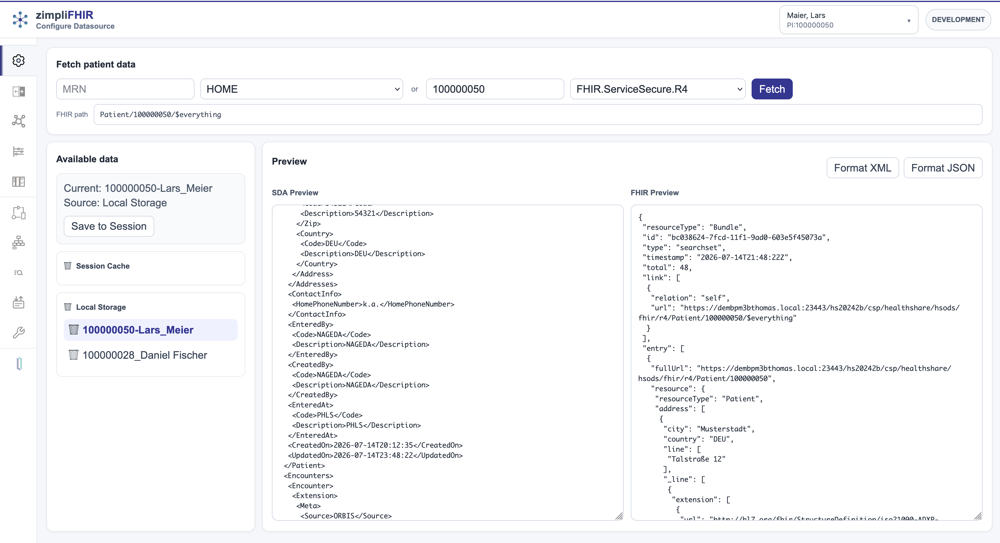
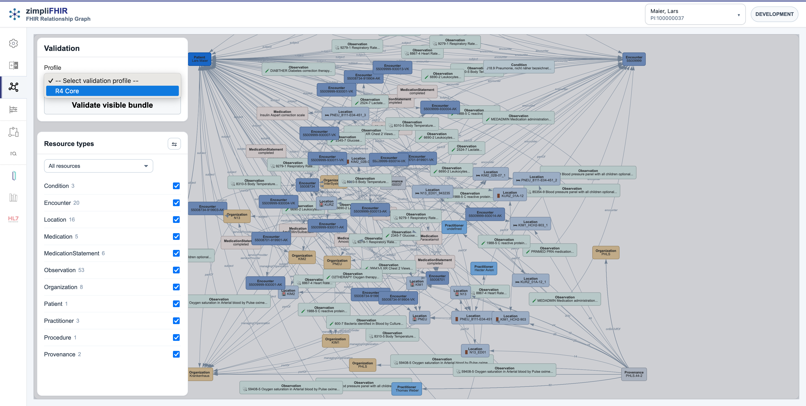
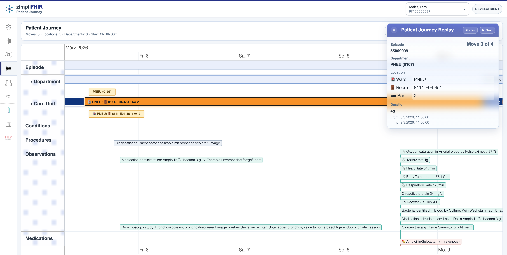
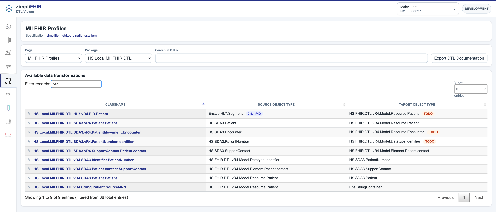
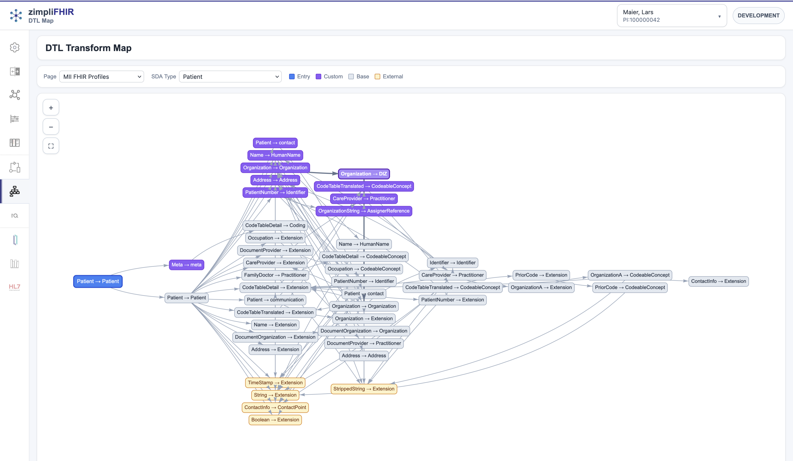
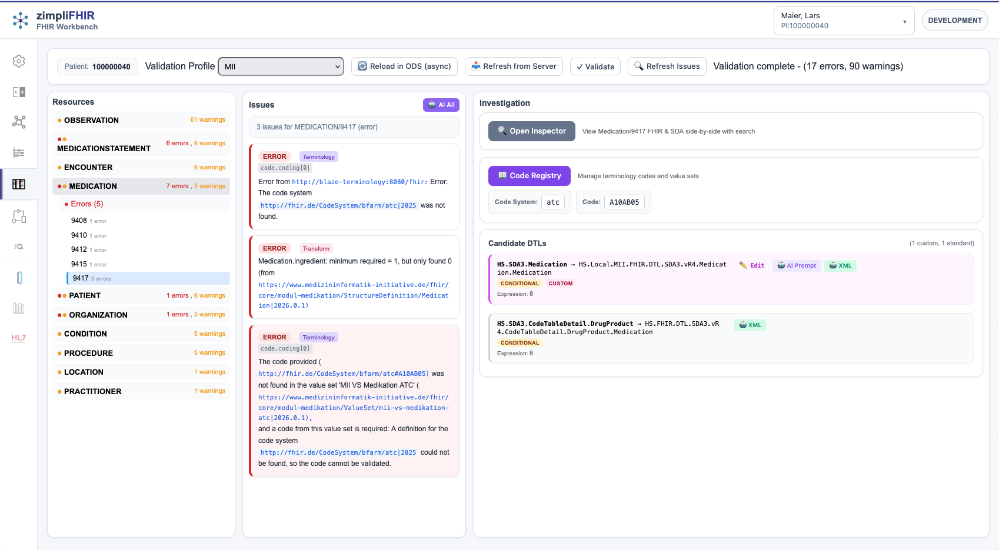

# zimpliFHIR Profiling Toolkit for HealthShare
*2026-07-15 • Brandon Thomas*

## Contents
- [Quick Start](#quick-start)
- [Overview](#overview)
- [Core Capabilities](#core-capabilities)
- [Installation](#installation)
    - [Classes and Dependencies](#classes-and-dependencies)
    - [InstanceProxy and Reload](#instanceproxy-and-reload)
    - [FHIR Validators](#fhir-validators)
    - [Blaze Terminology Server](#blaze-terminology-server)
    - [Service Registry Integration](#service-registry-integration)
    - [Configure Production](#configure-production)
    - [Navigate to the Startpage](#navigate-to-the-startpage)
    - [Disclaimer](#disclaimer)
- [Changelog](#changelog)
- [License](#license)

## Quick Start

New here? Read this first.

**What this is:** A developer CSP application running inside HealthShare that lets you inspect, compare, and validate FHIR data produced by the MII KDS transformation pipeline.

**What you need before anything works:**
1. An InterSystems HealthShare installation with the MII KDS DTL package deployed in `HSCUSTOM`
2. Docker (for the FHIR validators)
3. A running HealthShare production that ingests HL7v2/SDA3 and generates FHIR (the toolkit reads from it, it does not generate anything itself)

**Typical first-run checklist:**
1. Import classes into `HSCUSTOM` and compile
2. Run `##class(HS.Local.zimpli.fhir.API.Installer).Install()` from a terminal in `HSCUSTOM`
3. Copy `csp_assets/` to `{HS install}/csp/healthshare/zimplifhir/`
4. Start the `r4core-fhir-validator` Docker container (see [FHIR Validators](#fhir-validators))
5. If validating against MII profiles: clone and start the MII validator **and** load the required terminology into Blaze (see [Blaze Terminology Server](#blaze-terminology-server))
6. Register validators in the Service Registry (entries starting with `zimpliFHIR:validation:`)
7. Navigate to the start page and enter an MRN or MPIID to pull data

**The main views, in order of usefulness when debugging a transformation:**
- **Data Inspector** — side-by-side FHIR JSON / SDA3 for a patient; use this first to see what data is flowing
- **FHIR Relationship Graph** — network diagram of a bundle; trigger validation from here
- **Validation Workbench** — detailed issue investigation after a validator run (saves sessions to `%Persistent` `Issue` table — data persists across restarts)
- **DTL Viewer / DTL Map** — find which custom DTL class handles a given resource type and trace the full subtransform chain

---

## Overview

zimpliFHIR is a **developer-focused toolkit** for working with FHIR (and SDA3) in InterSystems HealthShare and IRIS. This package provides a number of tools which were developed to aid in the implementation of the [German MII FHIR profiles](https://simplifier.net/organization/koordinationsstellemii) in [InterSystems HealthShare](https://www.intersystems.com/interoperability-platform/). These tools are not intended for production use.

It supports:

* development and debugging of FHIR profiles  
* transformation validation (HL7 --> SDA <--> FHIR)  
* inspection of relationships between FHIR resources  
* temporal visualization for understanding data behavior  

---

## Core Capabilities

### 🔍 Data Exploration
* Inspect FHIR resources in context  
* Navigate references and dependencies  
* Identify missing or inconsistent links  

### 🔄 Transformation Support
* Compare SDA3 and FHIR representations  
* Inspect and debug DTL transformations  
* Visualise the full subtransform call chain for any entry-point DTL  

### 🕒 Temporal Visualization
* Timeline view of FHIR data (encounters, observations, medications, procedures, conditions)
* Expects the Encounter hierarchy as defined in MII

### 🧠 Relationship Analysis
* Graph-based visualization of FHIR resources  
* Highlight reference chains and integrity issues  

### ✅ Validation (REST)
* The relationship graph view can call external **FHIR validation services** via HTTP.  
* Validators are configured through the **Service Registry** (see below).

### 🔧 FHIR Validation Workbench
* **Three-pane issue investigation** - resource tree, issue list, and detailed investigation
* **Issue categorization** - grouped by resource type, severity (errors/warnings), and cause bucket
* **Candidate DTL analysis** - automatic identification of relevant transformations with custom/standard indicators
* **Terminology support** - quick access to Code Registry with auto-extracted codes and displays for easy fixes
* **AI-assisted troubleshooting** - generate comprehensive prompts for AI analysis including:
  - All issues for a resource or single-issue focus for DTL investigation
  - Full FHIR resource context and DTL transformation logic
  - Copy-to-clipboard integration for AI tools
* **Data Inspector integration** - side-by-side FHIR/SDA3 view with search and deep-linking
* **Session management** - save/load validation results with automatic MPIID tracking

### Screenshots


*Retrieve and compare SDA Containers with FHIR Bundles by MRN/AA or MPIID*

---

*Network diagram which displays the hierarchy of all resources within a FHIR bundle. Resource Validation, inspection, and filtering available here.*

---

*Timeline diagram of specific FHIR resources within a bundle. Expects MII Encounter hierarchies.*

---

*Extensible DTL Viewer with search, filter and export capabilities. Entry-point DTLs show a map icon — click it to open the DTL Map.*

---

*DTL Map — interactive graph showing the full subtransform call chain for a selected SDA type. Entry-point, custom, base, and external classes are colour-coded. Click any node to open an inline inspector.*

---

*FHIR Validation Workbench for investigating validation issues with integrated DTL analysis and AI troubleshooting prompts*

---

## Installation

### Classes and Dependencies
- [ ] Import and compile the classes from GitHub in the *HSCUSTOM* namespace.

---

### InstanceProxy and Reload

`HS.Local.zimpli.fhir.API.InstanceProxy` is a CSP page that exposes a small REST-style API. It must be compiled in **two namespaces**:

- **zimpliFHIR namespace** — used at page load (`config.gateways` to discover gateway URLs), by the Configuration page (`status.productions`, `status.interop`, `config.srEntries`), and server-side by DTLMap, DTLViewer, and Workbench to embed Flash Gateway base URLs via `GatewayBaseURL("F")`.
- **ODS namespace** — used exclusively for the `reload` action. On page load the frontend resolves the Flash Gateway base URL from `HS_Gateway.Config` and stores it in sessionStorage. When Reload is clicked the request goes directly to that ODS base URL, so `InstanceProxy` executes in the ODS namespace and calls `##class(HS.Local.Impl.Utils.ODS).ReloadPatient()` without any namespace switch. Without this class in the ODS namespace the Reload button will silently fail.

Endpoint pattern:
```
HS.Local.zimpli.fhir.API.InstanceProxy.cls?action=<action>&<params>
```

Available actions:

| Action | Description | Required params |
|---|---|---|
| `reload` | Re-triggers the ODS ReloadPatient for an MPIID | `mpiid=<MPIID>` |
| `config.gateways` | Lists all `HS_Gateway.Config` entries with derived base URLs | — |
| `config.srEntries` | Lists all Service Registry HTTP entries prefixed `zimpliFHIR:` | — |
| `status.productions` | Production run state for all namespaces on this instance | — |
| `status.interop` | Message counts and recent errors for a namespace | `ns=<namespace>`, `hours=<1-24>` |


---

## FHIR Validators

The repository includes a `validators/` directory with a ready-to-run setup and an optional MII validator:

```
validators/
  └── r4core-fhir-validator/
```

The MII validator is **not included by default** and must be cloned manually (see below).

---

### 🔹 R4 Core Validator

Location: `validators/r4core-fhir-validator`

This setup provides a lightweight validation container using Docker Compose.

Start via:

```bash
cd validators/r4core-fhir-validator
docker compose up -d
```

Runs on:
```
http://localhost:4567
```

Typical endpoint:
```
/validate
```

This validator:
- supports FHIR R4 core profiles
- does not include terminology services (SNOMED, etc.)

---

### 🔹 MII Validator (Recommended for German profiles)

This validator is based on the official MII project:

https://github.com/medizininformatik-initiative/mii-fhir-validator

#### Setup

Clone the repository into the `validators/` directory:

```bash
cd validators
git clone https://github.com/medizininformatik-initiative/mii-fhir-validator.git
```

Then follow the instructions in the official README.

⚠️ Notes:
- Setup is **non-trivial** and requires multiple steps
- Requires **SNOMED CT International RF2 release 20250701**
- Terminology files must be properly extracted and configured as described upstream

#### Start validator

Refer to the upstream documentation for the exact startup procedure.

Default endpoint (typically):
```
http://localhost:8080/validateResource
```

---

### 🔹 Blaze Terminology Server

The MII validator uses an internal **Blaze** FHIR server as its terminology backend (typically `blaze-terminology:8080` inside the Docker network, mapped to host port `8082`). Out of the box, Blaze only contains a small set of core FHIR CodeSystems. Many MII-specific and German-national CodeSystems (ATC, ICD-10-GM, kontaktart-de, Vitalstatus, etc.) must be loaded manually before validation results are meaningful.

#### What happens without it

Validation will pass structurally but every coded value will produce errors like:
```
The code system `http://fhir.de/CodeSystem/bfarm/atc` was not found.
Unknown code 'L' in https://www.medizininformatik-initiative.de/fhir/core/modul-person/CodeSystem/Vitalstatus
```

#### Step 1 — Load base profiles and MII packages

```bash
# Download the German base profiles package
curl -L -o /tmp/de.basisprofil.r4-1.5.4.tgz \
  https://packages.simplifier.net/de.basisprofil.r4/1.5.4

# Extract and PUT each CodeSystem / ValueSet into Blaze
cd /tmp && tar -xzf de.basisprofil.r4-1.5.4.tgz
for f in package/CodeSystem-*.json package/ValueSet-*.json; do
  id=$(python3 -c "import json,sys; d=json.load(open('$f')); print(d['resourceType']+'/'+d['id'])" 2>/dev/null)
  [ -n "$id" ] && curl -sS -X PUT "http://localhost:8082/fhir/$id" \
    -H "Content-Type: application/fhir+json" -d @"$f" -o /dev/null
done

# Repeat for MII packages (extract from validator container's /tmp/tx-cache or package cache)
```

After loading, verify:
```bash
curl -s "http://localhost:8082/fhir/CodeSystem?_count=1&_summary=count" | python3 -c \
  "import json,sys; print(json.load(sys.stdin)['total'], 'CodeSystems')"
```

A fully loaded Blaze will report ~80+ CodeSystems and ~80+ ValueSets.

#### Step 2 — BfArM-licensed CodeSystems (ATC, OPS)

ATC and OPS CodeSystems cannot be distributed in FHIR npm packages due to licensing restrictions. The packages only contain a metadata stub with `content: not-present`. Blaze refuses to validate against `not-present` systems, producing "code system not found" errors even when the resource is structurally correct.

**Fix:** upgrade each stub to `content: fragment` and seed it with the codes that appear in your data:

```python
import json, urllib.request

# Codes from your data — extend as needed
known_atc_codes = ["A10AB05", "N02BE01", "A", "A10", "A10A", "A10AB", "N", "N02", "N02B", "N02BE"]

# The mii-vs-medikation-atc ValueSet references ATC versions 2018–2025 — seed them all
for res_id, ver in [("atc","2025")] + [(f"atc-{v}",v) for v in ["2018","2019","2020","2021","2022","2023","2024","2025"]]:
    resp = urllib.request.urlopen(f"http://localhost:8082/fhir/CodeSystem/{res_id}")
    d = json.loads(resp.read())
    d["content"] = "fragment"
    d["version"] = ver
    d["concept"] = [{"code": c} for c in known_atc_codes]  # no displays — avoids display-mismatch errors
    body = json.dumps(d).encode()
    req = urllib.request.Request(f"http://localhost:8082/fhir/CodeSystem/{res_id}",
        data=body, headers={"Content-Type": "application/fhir+json"}, method="PUT")
    urllib.request.urlopen(req)
    print(f"{res_id} seeded")
```

Do the same for `ops` / `ops-{year}` with the OPS codes appearing in your data.

> **Note:** Fragment semantics mean any code *not* in the seed list will produce a "code not in fragment" warning. Add codes as they appear, or use a licensed BfArM terminology server for complete coverage.

#### Step 3 — Flush the validator's terminology cache

The MII validator caches terminology lookups in memory and on disk (`/tmp/tx-cache/` in the container). After changing Blaze content, restart the validator to flush both:

```bash
docker restart fhir-validator
```

> **Persistence note:** Resources PUT into Blaze are stored in the running container. If Blaze restarts without a persistent volume mapping for its data directory, all loaded resources must be reloaded. Check whether your `docker-compose.yml` mounts a volume for Blaze.

---

### 🔹 Service Registry Integration

zimpliFHIR discovers validators dynamically via the **Service Registry**.

Define HTTP entries where Name starts with `zimpliFHIR:validation:`


Example:

| Name                          | Host      | Port | URL             |
|-------------------------------|-----------|------|-----------------|
| zimpliFHIR:validation:r4core  | localhost | 4567 | /validate       |
| zimpliFHIR:validation:mii     | localhost | 8080 | /validateResource |

These entries:

- are used by **HS.Local.zimpli.fhir.Production.HTTPOperation**
- appear automatically in **FHIR Relationship Graph** validation dropdown

---

## Configure Production

A foundation-type production is required in HealthShare for retrieving SDA and FHIR. An installer method will configure this for you.

- [ ] From the terminal, use the installer script to setup the new namespace `ZIMPLIFHIR` and configure the production:

```objectscript
HSCUSTOM> do ##class(HS.Local.zimpli.fhir.API.Installer).Install()
```

#### Now in the Management Portal:

- [ ] Configure the *Business Operation* **GATEWAY** for SDA retrieval:
  - Set the **ServiceName** to an AccessGateway defined in the Service Registry  
    Example: `dembp18bthomas.local:HSACCESS`

- [ ] Configure the *Business Operation* **HS.FHIRServer.Interop.HTTPOperation**:
  - Used for FHIR retrieval **and validation**
  - Set the **ServiceName** to a default FHIR endpoint or validator entry  
    Example: `FHIR.ServiceSecure.R4`
  - The ServiceName can be overridden in the Datasource UI

- [ ] :bulb: Optionally add the *Business Operation* **HS.Util.Trace.Operations**

- [ ] Start the production

---

## Web Dependencies

The following external libraries are contained in the included zip file:

- [jQuery](https://jquery.com/)
- [DataTables css and js](https://datatables.net/)
- [simple tree table](https://github.com/kanety/jquery-simple-tree-table)
- [vis-network](https://visjs.org/)
- [vis-timeline](https://visjs.org/)

---

- [ ] Copy the contents of the csp_assets folder to:

```
{HealthShare Installation}/csp/healthshare/zimplifhir/
```

---

## Navigate to the Startpage

```
http://localhost:52774/csp/healthshare/zimplifhir/HS.Local.zimpli.fhir.UI.Index.cls
```

---

## Disclaimer

:warning: This application is not supported by InterSystems Corporation.  
Use at your own risk.

---

## Changelog

### 2026-07-15
- **Patient Journey timeline**: episode dropdown now shows visit number (identifier.value) instead of FHIR resource UUID
- **Patient Journey timeline**: double-click on any item navigates directly to that resource type+id in the Data Inspector; fixed collision where Encounter and Observation could share the same bare id
- `fhirResource` cache is now keyed by `ResourceType/id` (fully-qualified) throughout the timeline, preventing cross-type id collisions
- **InstanceProxy**: new `status.productions` and `status.interop` actions for production monitoring
- **InstanceProxy**: `config.gateways` now derives base URLs and management portal links for all registered gateways

### Previous Release
- Renamed class structure (!)
- UI cleanup and consolidation across all components
- Improved SDA3 and FHIR Inspector
- Improved encounter-centric visualization in **Patient Journey** timeline
- Extended **FHIR Relationship Graph**:
  - resource-type grouping
  - support for external FHIR validation services (REST)
- New **DTL Map** — interactive call-chain graph for DTL transformations:
  - supports outbound (SDA→FHIR) and inbound (FHIR→SDA) directions
  - colour-coded node groups: entry-point, custom, base, external
  - inline inspector with parent-chip navigation; entry-point DTLs link directly from DTL Viewer
- New **InstanceProxy** API class with `reload`, `config.gateways`, `config.srEntries` actions
- Various usability and interaction improvements

### Roadmap
- **DTL Viewer** — instance and namespace context (open DTL directly on the correct instance)
- Add tools for managing ^ISCSOAP, ^FSLOG; verify custom DTL package; Extension Mapping; FHIR validation

---

## License

This and all external libraries included with this package are available as open source under the terms of the [MIT License](https://opensource.org/license/MIT).

---

## Sponsors

Many thanks to our sponsor, the University Hospital of Hamburg-Eppendorf (UKE), Germany, for supporting this project and enabling the development of its first comprehensive user interface :tada:

[](https://www.uke.de)